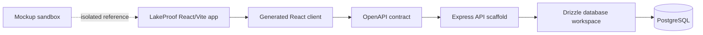

# LakeProof

> **A Lake Victoria seafood traceability workspace.** LakeProof presents a field-oriented user experience for recording catch provenance, following custody handovers, and presenting a public proof timeline.

LakeProof is organized as a TypeScript `pnpm` monorepo. The repository keeps the product-facing application, API scaffold, OpenAPI contract, generated client types, database workspace, and utility scripts in explicit boundaries. This document is the entry point for engineers, reviewers, and collaborators.

## Repository Status

The uploaded codebase is preserved exactly as provided. This repository organization pass adds **documentation, contribution policy, security policy, release notes, and an MIT license only**. It does not alter source code, package manifests, lockfiles, build commands, generated clients, database schema, dependencies, or application behavior.

The LakeProof frontend currently uses realistic local demonstration state while the shared API contract and database workspace are being finalized. Treat the existing UI as a functional product demonstration and the server, schema, and API packages as a structured foundation for the next engineering phase.

## Why LakeProof Exists

Small-scale fisheries depend on trustworthy records of where a catch came from, who handled it, and how it moved from landing site to buyer. In practice, that information is often fragmented across paper records, messaging threads, and disconnected systems. LakeProof presents one continuous evidence journey:

1. **Register** a catch at the landing site.
2. **Progress custody** through landing, transport, processing, and market handovers.
3. **Verify proof** through a public, redacted provenance timeline.

The product is designed around the fixed lifecycle **Catch → Landing → Transport → Processing → Market**. An integrity boundary remains explicit: an intact digital chain shows that accepted stored data has not been changed later; it does not prove that the original physical claim was truthful.

For the detailed context, users, constraints, and scope, see [`docs/PROBLEM_DEFINITION.md`](docs/PROBLEM_DEFINITION.md).

## Quick Start

### Prerequisites

| Requirement | Purpose |
|---|---|
| Node.js 24 | Workspace runtime documented by the project brief. |
| pnpm | Required package manager; the root preinstall guard rejects other package managers. |
| PostgreSQL connection string | Needed only for database operations through `lib/db`. |

## Stack

- pnpm workspaces, Node.js 24, TypeScript 5.9
- API: Express 5
- DB: PostgreSQL + Drizzle ORM
- Validation: Zod (`zod/v4`), `drizzle-zod`
- API codegen: Orval (from OpenAPI spec)
- Build: esbuild (CJS bundle)

## Where things live

- `artifacts/lakeproof/src/App.tsx` — route-aware frontend experience and local session demo state
- `artifacts/lakeproof/src/index.css` — shared editorial Lake Victoria theme, typography, grain, and responsive rules
- `artifacts/lakeproof/public/images/` — approved Lake Victoria and fisher imagery used by the app
- `artifacts/api-server/` — shared API service scaffold
- `lib/api-spec/openapi.yaml` — shared API contract source of truth
- `lib/db/src/schema/` — shared PostgreSQL schema source of truth

```bash
# Install the workspace dependencies.
pnpm install

# Verify all referenced TypeScript projects.
pnpm run typecheck

# Build all workspace packages that expose a build script.
pnpm run build
```

pnpm ignores the `esbuild` build script by default. If `pnpm install` or a later `--filter ... run dev` prints `[ERR_PNPM_IGNORED_BUILDS] Ignored build scripts: esbuild`, resolve it once per machine:

```bash
pnpm approve-builds
pnpm rebuild esbuild
pnpm install
```

### Environment Variables

| Variable | Required by | Purpose |
|---|---|---|
| `PORT` | `@workspace/lakeproof` (dev/preview), `@workspace/api-server` (dev) | Listening port for the Vite dev server or the Express server. |
| `BASE_PATH` | `@workspace/lakeproof` (dev/build/preview) | Vite `base` path. The API scaffold does not read this variable. |
| `DATABASE_URL` | `@workspace/db` (`push`, `push-force`) | PostgreSQL connection string for Drizzle operations. |

### Run the Frontend

```bash
PORT=5173 BASE_PATH=/ pnpm --filter @workspace/lakeproof run dev
```

### Run the API Scaffold

```bash
PORT=5000 pnpm --filter @workspace/api-server run dev
```

## Workspace Map

```text
.
├── artifacts/
│   ├── lakeproof/           # React/Vite product experience
│   ├── api-server/          # Express API scaffold
│   └── mockup-sandbox/      # Isolated visual/mockup workspace
├── lib/
│   ├── api-spec/            # OpenAPI source of truth and code generation
│   ├── api-client-react/    # Generated React Query client wrapper
│   ├── api-zod/             # Generated Zod schemas and types
│   └── db/                  # Drizzle/PostgreSQL workspace boundary
├── scripts/                 # Repository utility scripts
├── attached_assets/         # Approved visual/reference assets; not application logic
├── docs/                    # Engineering and product documentation
├── replit.md                # Existing runtime and project operating notes
├── pnpm-workspace.yaml      # Workspace, dependency catalog, and supply-chain policy
└── pnpm-lock.yaml           # Locked dependency graph
```

See [`docs/REPOSITORY_MAP.md`](docs/REPOSITORY_MAP.md) for ownership boundaries and source-of-truth rules.

## Architecture at a Glance



The frontend, API, contract, and database are separated intentionally. Contract changes originate in `lib/api-spec/openapi.yaml`; generated client and validation code should be regenerated rather than manually edited. The exact current boundary is documented in [`docs/ARCHITECTURE.md`](docs/ARCHITECTURE.md).

## Development Commands

| Command | Description |
|---|---|
| `pnpm install` | Install the locked workspace dependencies. |
| `pnpm run typecheck` | Type-check shared libraries, artifact workspaces, and scripts. |
| `pnpm run build` | Type-check and build all packages exposing a build script. |
| `PORT=5173 BASE_PATH=/ pnpm --filter @workspace/lakeproof run dev` | Start the Vite frontend. Both variables are required. |
| `PORT=5000 pnpm --filter @workspace/api-server run dev` | Build and start the API scaffold. Only `PORT` is required. |
| `pnpm --filter @workspace/api-spec run codegen` | Generate API client and Zod artifacts from OpenAPI. |
| `pnpm --filter @workspace/db run push` | Push the Drizzle schema in development only. |

> **Do not edit generated API code by hand.** Modify the OpenAPI source first, then run the code-generation command and review the generated diff.

## Engineering Rules

| Area | Rule |
|---|---|
| Package manager | Use `pnpm` only. The repository enforces this at preinstall time. |
| Dependencies | Respect `pnpm-workspace.yaml`, including the catalog and minimum release age policy. |
| API changes | Update `lib/api-spec/openapi.yaml`, regenerate clients, then type-check. |
| Database changes | Change `lib/db/src/schema`, review generated migration behavior, and use a non-production database first. |
| Visual assets | Keep current approved assets in their existing locations unless the owning product workflow approves a move. |
| Secrets | Never commit credentials, connection strings, access tokens, or production data. |

## Documentation

| Document | Use it for |
|---|---|
| [`docs/PROBLEM_DEFINITION.md`](docs/PROBLEM_DEFINITION.md) | Product problem, users, scope, and intended outcomes. |
| [`docs/ARCHITECTURE.md`](docs/ARCHITECTURE.md) | System boundaries, data/contract flow, and maturity notes. |
| [`docs/REPOSITORY_MAP.md`](docs/REPOSITORY_MAP.md) | Workspace ownership and source-of-truth rules. |
| [`docs/DEVELOPMENT.md`](docs/DEVELOPMENT.md) | Local development, code generation, database, and review workflow. |
| [`docs/REORGANIZATION.md`](docs/REORGANIZATION.md) | Exact documentation-only changes and integrity verification method. |
| [`CONTRIBUTING.md`](CONTRIBUTING.md) | Branch, review, and pull-request expectations. |
| [`SECURITY.md`](SECURITY.md) | Vulnerability reporting and secure-development expectations. |

## Roadmap Boundary

This repository provides the current LakeProof product experience and integration structure. Production-grade deployment work remains deliberately separate: authenticated API behavior, database migrations, persistent event storage, background synchronization, public verification hardening, and operational monitoring should be implemented as reviewed milestones—not inferred from local demonstration state.

## License

LakeProof is released under the [MIT License](LICENSE).

## Conclusion

LakeProof is now presented as a clean, navigable engineering repository: product experience in `artifacts/`, reusable contracts and platform code in `lib/`, utilities in `scripts/`, and clear operational knowledge in `docs/`. Start with this README, then use the repository map and development guide before making a change.
