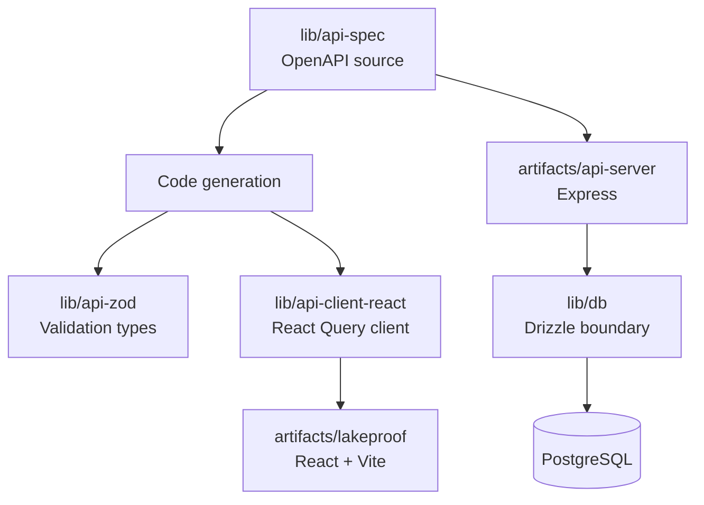

# Architecture

## Overview

LakeProof is a `pnpm` workspace monorepo that separates the product interface, HTTP service scaffold, API contract, generated type clients, database boundary, and utilities. This separation enables individual packages to evolve without coupling every change to the frontend.

## Responsibility Boundaries

| Location | Responsibility | Change source of truth |
|---|---|---|
| `artifacts/lakeproof/` | Product-facing React/Vite interface and approved product media. | UI source under `src/`. |
| `artifacts/api-server/` | Express service scaffold, middleware, and route composition. | Server source under `src/`. |
| `lib/api-spec/` | OpenAPI contract and Orval generation configuration. | `openapi.yaml`. |
| `lib/api-client-react/` | Generated React Query API access layer and fetch setup. | Generated from the API spec; do not hand-edit generated output. |
| `lib/api-zod/` | Generated Zod schema and shared API types. | Generated from the API spec; do not hand-edit generated output. |
| `lib/db/` | Drizzle configuration and PostgreSQL schema boundary. | `src/schema/`. |
| `scripts/` | Repository-level utility scripts. | Script source. |
| `artifacts/mockup-sandbox/` | Isolated mockup/reference workspace. | Sandbox source only; do not confuse it with the product runtime. |

## Current Maturity

The repository purposefully exposes its current maturity. The LakeProof frontend provides a working product presentation with local demonstration state. The shared OpenAPI contract currently includes a small bootstrap surface, and the database schema boundary is not yet a finished production domain model. Engineering teams should treat the workspace layout as a strong foundation, not as evidence that each production integration is already complete.

## Contract-First Change Flow

1. Update `lib/api-spec/openapi.yaml`.
2. Run `pnpm --filter @workspace/api-spec run codegen`.
3. Review generated changes in `lib/api-client-react` and `lib/api-zod`.
4. Implement or update server behavior in `artifacts/api-server`.
5. Consume the typed client in `artifacts/lakeproof`.
6. Run `pnpm run typecheck` and `pnpm run build`.

## Runtime Configuration

| Variable | Used by | Purpose |
|---|---|---|
| `PORT` | API runtime | Runtime-provided listening port. |
| `BASE_PATH` | API runtime | Runtime-provided base path. |
| `DATABASE_URL` | `lib/db` | PostgreSQL connection string for Drizzle operations. |

Secrets belong in the environment or a managed secrets facility. They must never be committed to the repository or embedded into client source.

## Security Posture

The root workspace policy enables a one-day `minimumReleaseAge` for npm packages, limits build scripts through `onlyBuiltDependencies`, and centralizes key dependency versions in a catalog. Preserve these controls unless a reviewed security decision documents a specific exception.
